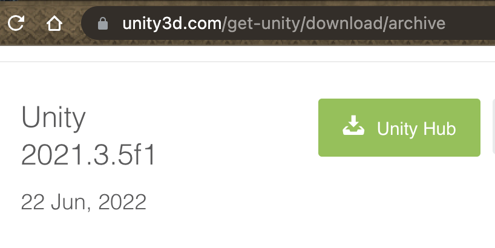
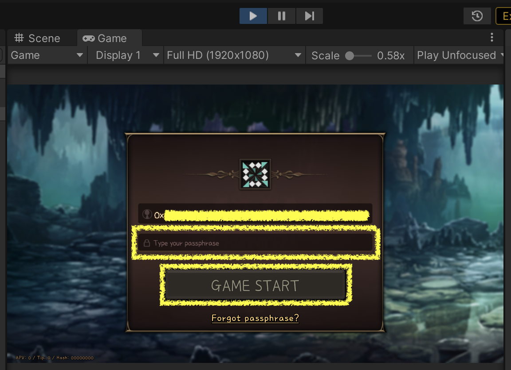

[플라네타리움][planetarium-page]에서 배포하는 [나인 크로니클][9c-page]는 [유니티][unity-page]를 사용해서 만들었습니다. 이는 나인 크로니클을 유니티 에디터로 실행할 수 있다는 말이고, 이 문서에서는 그 방법을 소개합니다.

[planetarium-page]: https://planetariumhq.com/
[9c-page]: https://nine-chronicles.com/
[unity-page]: https://unity.com/

# 유니티 설치하기

여기서는 `유니티 허브`를 사용한 유니티 설치 방법을 소개합니다.

## 유니티 허브 설치하기

### 1. [유니티 허브 다운로드 링크][unity-hub-download-link]를 클릭합니다.

- 위의 링크가 동작하지 않으면 [유니티 다운로드 페이지][unity-download-page]에서 유니티 허브를 다운로드 합니다.

### 2. 다운로드한 유니티 허브 설치 파일을 실행합니다.

[unity-hub-download-link]: https://public-cdn.cloud.unity3d.com/hub/prod/UnityHubSetup.dmg
[unity-download-page]: https://unity3d.com/get-unity/download

## 유니티(2021.3.5f1) 설치하기

### 1. [유니티 허브용 유니티(2021.3.5f1) 설치 링크][unity-install-with-hub-2021.3.5f1]를 클릭합니다.

- 위 링크가 동작하지 않으면 [유니티 다운로드 아카이브 페이지][unity-download-archive-page]에서 유니티(2021.3.5f1)를 다운로드 합니다. 이때 녹색 유니티 허브 버튼으로 설치합니다.

  

### 2. 유니티 허브가 실행되면서 유니티(2021.3.5f1) 설치가 진행됩니다.

[unity-install-with-hub-2021.3.5f1]: unityhub://2021.3.5f1/40eb3a945986
[unity-download-archive-page]: https://unity3d.com/get-unity/download/archive

# 나인 크로니클 저장소 복제하기

여기서는 저장소를 복제하는 방법으로 [Git CLI][git-page]를 사용하는 방법과 [Fork][fork-page]를 사용하는 방법을 다룹니다.

[git-page]: https://git-scm.com/
[fork-page]: https://git-fork.com/

## Git CLI로 복제하기

### 1. 운영체제에 맞는 Git CLI를 설치합니다.

- [Windows](https://git-scm.com/download/windows)
- [Mac](https://git-scm.com/download/mac)
- [Linux](https://git-scm.com/download/linux)

### 2. 나인 크로니클 저장소를 복제합니다.

```
$ git clone https://github.com/planetarium/NineChronicles.git
$ cd NineChronicles
$ git submodule update --init --recursive
$ git config core.hooksPath hooks
```

### 3. main 브랜치로 체크아웃합니다.

```
$ git checkout main
$ git submodule update --recursive
```

## Fork로 복제하기

### 1. 운영체제에 맞는 Fork를 설치합니다.

- [Windows(installer)](https://git-fork.com/update/win/ForkInstaller.exe)
- [Mac(2.20.2)](https://cdn.fork.dev/mac/Fork-2.20.2.dmg)
- 위 링크가 동작하지 않거나 다른 버전을 설치하고 싶다면 [Fork 페이지][fork-page]로 접속해서 다운로드 합니다.

### 2. Fork를 실행해서 나인 크로니클 저장소를 복제합니다.

- `File > Clone` 메뉴를 클릭합니다.

   Clone` menu"
    src="./images/fork-menu-file-clone.png"
    style="width:50vw" />

- `URL`과 `Location`을 입력하고 `Clone` 버튼을 클릭합니다.
  - URL: `https://github.com/planetarium/NineChronicles.git`
  - Location: 아래의 이미지에서 저는 "`/Users/seungmin/Repositories/NineChronicles`"로 지정했습니다.

  

### 3. `main` 브랜치로 체크아웃 합니다.

- `Remotes > Origin > main` 브랜치를 우클릭하고 `Checkout 'origin/main'...` 메뉴를 클릭합니다.

   Origin > main` -> `Checkout 'origin/main'...` menu"
    src="./images/fork-checkout-main.png"
    style="width:50vw" />

- 이어서 뜨는 팝업에서는 `Track` 버튼을 클릭합니다.

  

# 유니티 에디터로 나인 크로니클 플레이하기

## 유니티 허브로 나인 크로니클 프로젝트 열기

### 1. Unity Hub를 실행합니다.

여기서는 Unity 계정 생성과 라이센스에 대해서는 설명하지 않습니다. 무료(유니티 Personal 라이센스)로도 진행할 수 있습니다.

### 2. 나인 크로니클 프로젝트를 엽니다.

- 최초 실행시 `Projects > Open` 버튼을 클릭합니다.

   Open` button"
    src="./images/unity-hub-projects-open.png"
    style="width:50vw" />

- 나인 크로니클 저장소를 복제한 위치에서 `/nekoyume` 폴더를 선택하고 `Open` 버튼을 클릭합니다.

  

## `clo.json` 설정하기

clo.json 파일은 블록체인 네트워크와 관련한 다양한 옵션을 설정하는 파일입니다.

### 1. 복제한 경로를 기준으로 `/nekoyume/Assets/StreamingAssets/` 안에 clo.json 파일을 생성합니다.

### 2. clo.json 파일은 아래와 같이 채워 넣고 저장합니다.

```json
{
    "GenesisBlockPath": "https://download.nine-chronicles.com/genesis-block-9c-main",
    "NoMiner": true,
    "RpcClient": true,
    "RpcServerHost": "9c-main-rpc-1.nine-chronicles.com",
    "RpcServerPort": 31238,
    "ApiServerHost": "https://api.9c.gg/graphql"
}
```

## `Key Store` 경로에 키 준비하기

나인 크로니클을 플레이하기 위해서는 블록체인 네트워크에 참여하기 위해 Private Key가 필요합니다.
이미 나인 크로니클을 플레이한 적이 있다면, 이미 Private Key와 Protected Private Key를 갖고 있다는 말입니다.

- Private Key: 트렌젝션에 서명할 때 필요한 키입니다.
- Protected Private Key: Private Key를 암호화한 파일입니다.

### 1. Private Key 생성하기

- 이 단계를 건너띄고 [플레이](#플레이) 단계로 넘어가서 Private Key를 생성하는 단계를 이용합니다.

### 2. 갖고 있는 Protected Private Key를 Key Store 경로에 넣기

- Key Store 경로
  - Protected Private Key를 보관하는 경로입니다.
  - 이 경로의 기본값은 [Libplanet 0.41.0 버전][libplanet-0.41.0]을 기준으로 [이렇게][default-path-of-key-store] 결정됩니다.
  - Windows
    - `%appdata%\planetarium\keystore\`
  - Mac
    - `/Users/USERNAME/.config/planetarium/keystore/` or
    - `/Users/USERNAME/Library/Application Support/planetarium/keystore/`
  - Linux
    - `home/planetarium/keystore/` or
    - `home/.config/planetarium/keystore/`

[default-path-of-key-store]: https://github.com/planetarium/libplanet/blob/0.41.0/Libplanet/KeyStore/Web3KeyStore.cs#L21-L29
[libplanet-0.41.0]: https://github.com/planetarium/libplanet/tree/0.41.0

### 3. (not recommended) clo.json 파일에 직접 Private Key를 설정하기

- 기존 clo.json 파일에 `"PrivateKey"` 항목을 추가합니다.

  ```json
  {
      "PrivateKey": "your-pivate-key"
  }
  ```

## 플레이

이제 나인 크로니클 메인넷에 접속해서 플레이할 준비를 모두 마쳤습니다.

### 1. `Game` 씬을 엽니다.

- `/nekoyume/Asseta/_Scenes/` 경로의 Game 씬을 더블클릭합니다.

  

### 2. Play 버튼을 클릭합니다.

- 유니티 에디터 상중단의 ▶️ 버튼을 클릭합니다.

  

### 3. 로그인 합니다.

- clo.json 파일에 "PrivateKey"를 입력하면 이 과정이 생략됩니다.
- 로그인 팝업에서 선택된 계정의 주소를 확인하고 `passphrase`를 입력합니다.
- 그리고 `GAME START` 버튼을 클릭합니다.

  

# 마치며

여기까지 유니티 에디터를 이용해서 나인 크로니클 main 네트워크에 접속하는 방법을 소개했습니다.
이 방법을 유지하기 위해서는 나인 크로니클 저장소의 main 브랜치를 꾸준히 당겨와야 합니다.

앞으로 이 내용을 기반으로 다양한 팁들을 소개할 예정입니다.
