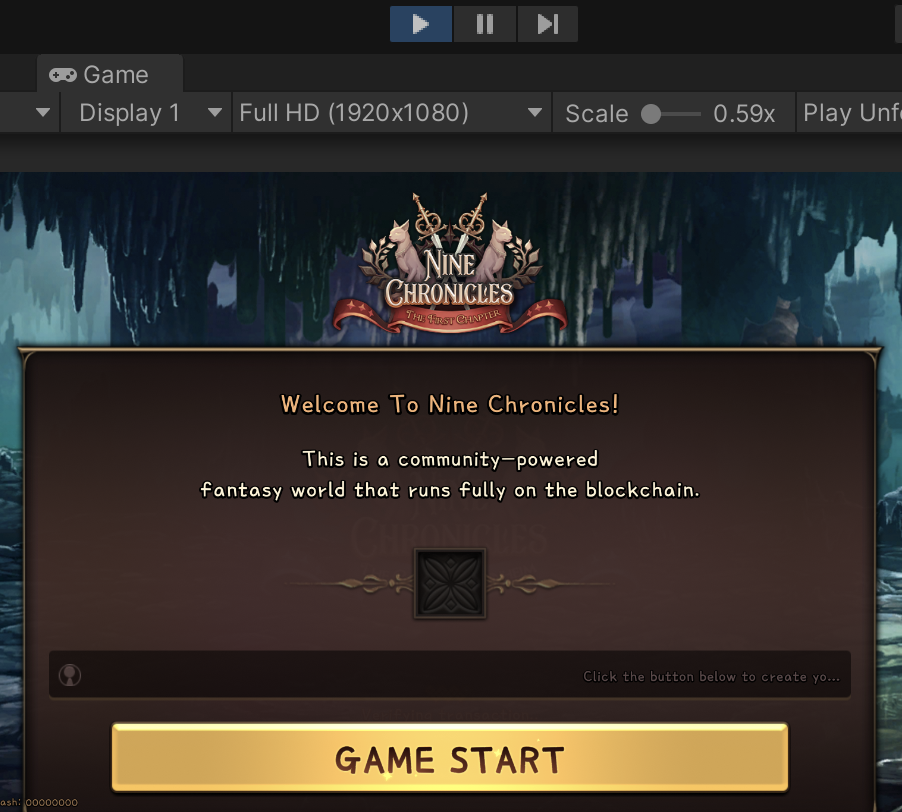
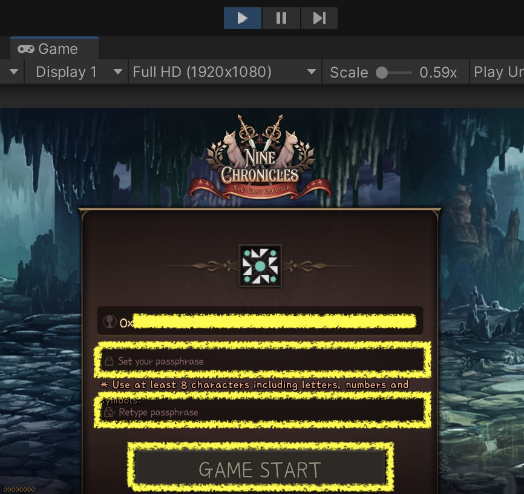

The [Nine Chronicles][9c-page] which is published by [Planetarium][planetarium-page] is developed with [Unity][unity-page]. It means the Nine Chronicles can execute by Unity Editor, And this article will show you how.

[planetarium-page]: https://planetariumhq.com/
[9c-page]: https://nine-chronicles.com/
[unity-page]: https://unity.com/

# Install Unity

Here's how to install Unity with Unity Hub.

## Install Unity Hub

### 1. Click the Unity Hub download link for your operating system.

- [Windows(.exe)](https://public-cdn.cloud.unity3d.com/hub/prod/UnityHubSetup.exe)
- [Mac(.dmg)](https://public-cdn.cloud.unity3d.com/hub/prod/UnityHubSetup.dmg)
- If the above link does not work, download Unity Hub from [Unity download page][unity-download-page].

### 2. Run the downloaded Unity Hub installation file.

[unity-download-page]: https://unity3d.com/get-unity/download

## Install Unity(2021.3.5f1)

### 1. Click [Unity(2021.3.5f1) installation link for Unity Hub][unity-install-with-hub-2021.3.5f1].

- If the above link does not work, download Unity(2021.3.5f1) from [Unity downlad archive page][unity-download-archive-page]. At this time, install with the green Unity Hub button.

  

### 2. Unity(2021.3.5f1) installation proceeds with Unity Hub running.

[unity-install-with-hub-2021.3.5f1]: unityhub://2021.3.5f1/40eb3a945986
[unity-download-archive-page]: https://unity3d.com/get-unity/download/archive

# Cloning the Nine Chronicles repository

Here I cover how to use [Git CLI][git-page] and [Fork][fork-page] as a way to clone a repository.

[git-page]: https://git-scm.com/
[fork-page]: https://git-fork.com/

## Cloning with the Git CLI

### 1. Install the Git CLI for your operating system.

- [Windows](https://git-scm.com/download/windows)
- [Mac](https://git-scm.com/download/mac)
- [Linux](https://git-scm.com/download/linux)

### 2. Clone the Nine Chronicles repository.

```
$ git clone https://github.com/planetarium/NineChronicles.git
$ cd NineChronicles
$ git submodule update --init --recursive
$ git config core.hooksPath hooks
```

### 3. Checkout to the `main` branch.

```
$ git checkout main
$ git submodule update --recursive
```

## Cloning with the Fork

### 1. Install the Fork for your operating system.

- [Windows(.exe)](https://git-fork.com/update/win/ForkInstaller.exe)
- [Mac(2.20.2)(.dmg)](https://cdn.fork.dev/mac/Fork-2.20.2.dmg)
- If above link does not work or if you want to install another version, go to the [Fork page][fork-page] and download it.

### 2. Run the Fork and clone the Nine Chronicles repository.

- Click `File > Clone` menu.

   Clone` menu"
    src="./images/fork-menu-file-clone.png"
    style="width:50vw" />

- Enter `URL` and `Location` ant click the `Clone` button.
  - URL: `https://github.com/planetarium/NineChronicles.git`
  - Location: In the image below, I spesified it as "`/Users/seungmin/Repositories/NineChronicles`".

  

### 3. Checkout to the main branch.

- Right-click the `Remotes > Origin > main` branch and click the `Checkout 'origin/main'...` menu.

   Origin > main` -> `Checkout 'origin/main'...` menu"
    src="./images/fork-checkout-main.png"
    style="width:50vw" />

- In the following popup, click the `Track` button.

  

# Play the Nine Chronicles with the Unity editor

## Open the Nine Chronicles project with the Unity Hub

### 1. Run the Unity Hub.

Unity account creation and licensing are not covered here. You can also proceed for free(Unity Personal License).

### 2. Open the Nine Chronicles project.

- Click the `Projects > Open` button when running for the first time.

   Open` button"
    src="./images/unity-hub-projects-open.png"
    style="width:50vw" />

- Select the `/nekoyume` folder in the location where you cloned the Nine Chronicles repository and click the `Open` button.

  

## Configure `clo.json`

The clo.json file is a file that sets various options related to the blockchain network.

### 1. Create a clo.json file in `/nekoyume/Assets/StreamingAssets/` based on the cloned path.

### 2. Fill in the clo.json file as shown below and save it.

```json
{
    "GenesisBlockPath": "https://download.nine-chronicles.com/genesis-block-Nine Chronicles-main",
    "NoMiner": true,
    "RpcClient": true,
    "RpcServerHost": "9c-main-rpc-1.nine-chronicles.com",
    "RpcServerPort": 31238,
    "ApiServerHost": "https://api.9c.gg/graphql"
}
```

## Prepare the key in the `Key Store` path

In order to play the Nine Chronicles, you need a Private Key to participate in the blockchain network.
If you've already played the Nine Chronicles, that means you already have a Private Key and a Protected Private Key.

- Private Key: A key required to sign a transaction.
- Protected Private Key: This is the encrypted file of the private key.

### 1. Generate Private Key

- Skip this step and go to the [Play](#play) step to use the step to generate a private key.

### 2. Put your Protected Private Key into the Key Store path

- Key Store path
  - The path to keep the Protected Private Key.
  - The default value of this path is determined [this way] [default-path-of-key-store] based on [Libplanet 0.41.0 version][libplanet-0.41.0].
  - Windows
    - `%appdata%\planetarium\keystore\`
  - Mac
    - `/Users/USERNAME/.config/planetarium/keystore/` or
    - `/Users/USERNAME/Library/Application Support/planetarium/keystore/`
  - Linux
    - `home/planetarium/keystore/` or
    - `home/.config/planetarium/keystore/`

[default-path-of-key-store]: https://github.com/planetarium/libplanet/blob/0.41.0/Libplanet/KeyStore/Web3KeyStore.cs#L21-L29
[libplanet-0.41.0]: https://github.com/planetarium/libplanet/tree/0.41.0

### 3. (not recommended) Setting the private key directly in the clo.json file

- Add a `"PrivateKey"` entry to the existing clo.json file.

  ```json
  {
      "PrivateKey": "your-pivate-key"
  }
  ```

## Play

You are now ready to access the Nine Chronicles mainnet and play.

### 1. Open the `Game` scene.

- Double-click the Game scene in the `/nekoyume/Asseta/_Scenes/`.

  

### 2. Click the `Play` button.

- Click the ▶️ button at the top and middle of the Unity editor.

  

### 3. Sign in.

- Go to [3.1.](#31-sign-up) if there is no Protected Private Key in the Key Store path.
- If there is no Protected Private Key in the Key Store path, go to [3.1.](#31-sign-up).
- If you enter "PrivateKey" in the clo.json file, this process is skipped.
- Confirm the address of the selected account in the login pop-up and enter `passphrase`.
- And click the `GAME START` button.

  

#### 3.1. Sign up.

You can generate the Private Key and the Protected Private Key in this step.

- Click the `GAME START` button

  

- Fill the passphrase and click the `GAME START` button.

  

# Conclusion

So far, I have introduced how to connect to the Nine Chronicles main network using the Unity Editor.
In order to maintain this method, you will need to consistently pull the main branch of the Nine Chronicles repository.

I plan to introduce various tips based on this content in the future.
