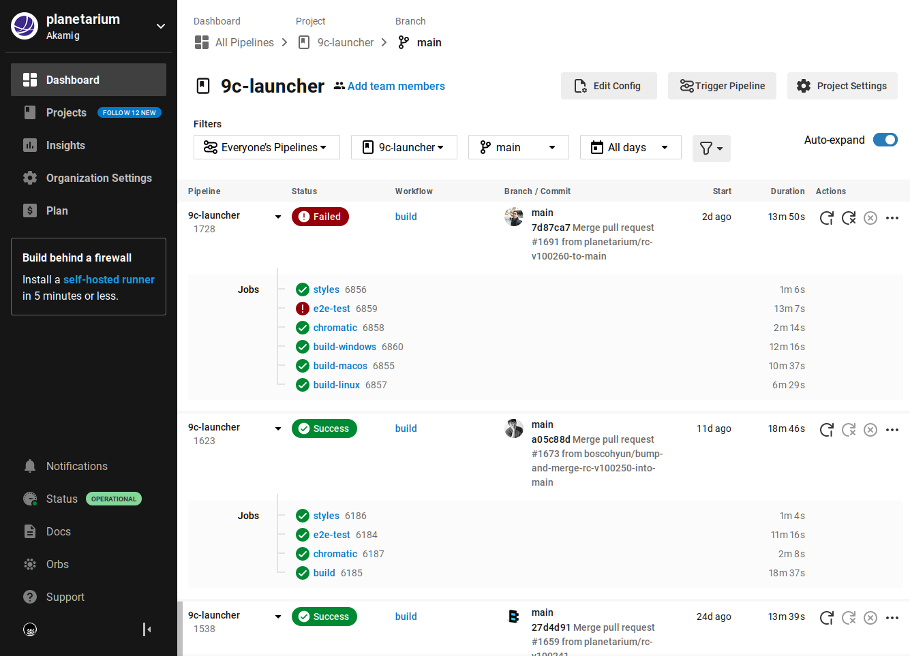
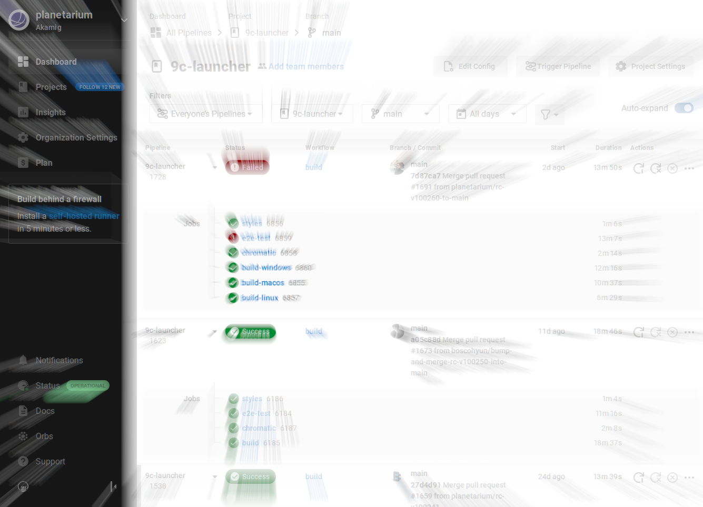
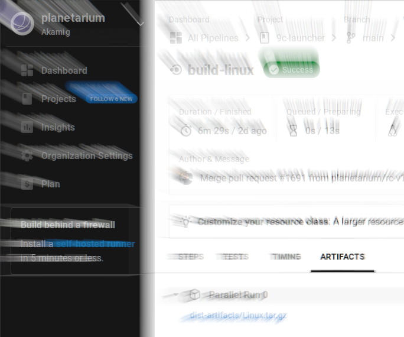
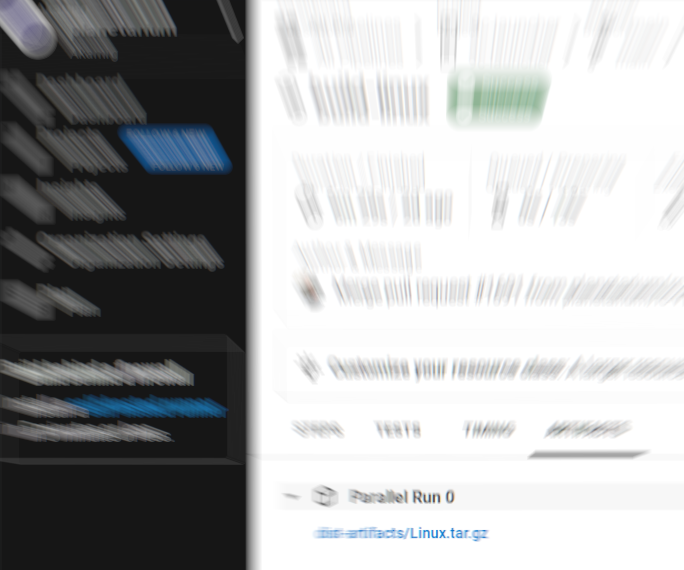
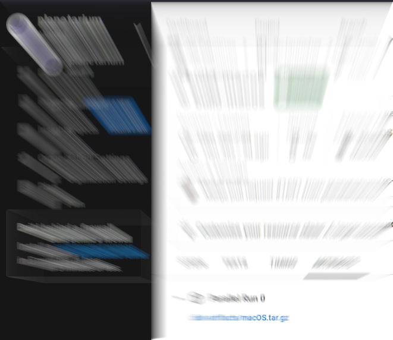
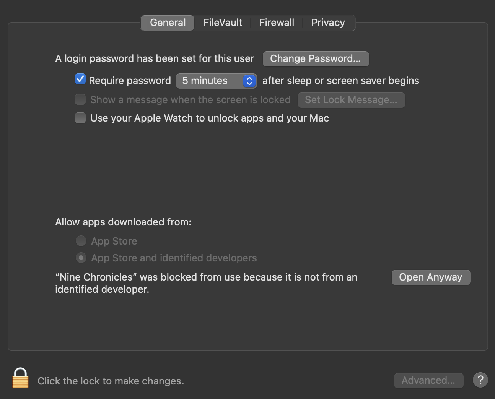

# 0. DISCLAMER
THIS UNOFFICIAL METHOD DOES NOT GUARANTEE THE NORMAL OPERATION OF THE SOFTWARE (INCLUDING LAUNCHER AND GAME CLIENT) AND WE DOES NOT PROVIDE OFFICIAL TECHNICAL SUPPORT. OUR PRIMARY ISSUE PRIORITY IS ALWAYS WINDOWS FIRST. AND THESE TARGETS ARE USED FOR INTERNAL TEST ONLY. USE AT YOUR OWN RISKS. THIS EXPLANATION WILL PRESUME YOU KNOW WHAT YOU'RE DOING.

# 1. Get Artifact

## [1.1. Open 9c-launcher CircleCI Pipelines page](https://app.circleci.com/pipelines/github/planetarium/9c-launcher?branch=main)

[Here.](https://app.circleci.com/pipelines/github/planetarium/9c-launcher?branch=main)

## 1.2. Click Workflow "build", and click Succeed (Green) "build-{your OS}"

## 1.3. Click Artifact

## 1.4. Download and Decompress Artifact

# 2. Run on Linux

After decompression, you path would look like this.

Its permission is presetted so usually clicking Nine Chronicles launches launcher and will do it's job. (Downloading Game Client, Updating config.json, etc)

In case of permission issue, `chmod +x ./Nine Chronicles` will do the trick.

Now it works!

config.json file is
    - (on macOS) `~/Library/Application Support/Nine Chronicles/config.json`
    - (on Linux) `~/.config/Nine Chronicles/config.json`

And you can import private key using Libplanet.Tools, so called [`planet`](https://github.com/planetarium/libplanet/releases). or, you can mount windows and copy keystore folder under `%APPDATA%/planetarium/keystore` and put it on `~/.config/planetarium/keystore` I'll trust you would work this part out by yourself.

# 3. Run on Intel Mac

it looks like after decompression.
Same as linux, clicking Nine Chronicles.app would work.
But If Security Option complains or it tries to send it to trash,

from System Preference → Click Open Anyway.

## 4.1. TroubleShooting

### 4.1.1. .NET core 3.1 installation on Ubuntu 22.04

1. According to [https://docs.microsoft.com/en-us/dotnet/core/install/linux-ubuntu#supported-distributions](https://docs.microsoft.com/en-us/dotnet/core/install/linux-ubuntu#supported-distributions), distro's OpenSSL v3 limitation .NET core 3.1 is not officially supported.
2. You can resolve it by installing .NET 6.0 first and push 3.1's tarball to it's path.
    1. You can install .NET 6.0 with `apt install dotnet-sdk`
3. From [https://dotnet.microsoft.com/en-us/download/dotnet/3.1](https://dotnet.microsoft.com/en-us/download/dotnet/3.1) download binary matching your OS and architecture.
4. There will be some folders simillar to `/usr/share/dotnet`, compare them and merge them accordingly.
    1. At some part of this you would see folder name including 6 on`/usr/share/dotnet` and 3 on decompressed path. add content of "3" in "6".
5. You should see 3.1, 6.0 after execute `dotnet --list-sdks`.

### 4.1.2. 🗯️It's not working! / Just white window appears!

Don't panic. remain calm. it happens. 

### 4.1.3. 🗯️Launcher background image is missing!

We don't know why yet but it happens sometimes. it's not affecting launcher's execution, but we would welcome your log file (it's in the same path as config.json) if you leave it to development discord.

### 4.1.4. 🗯️Game does not executed, but there's no START button on launcher!

Game client may be executed on background, open your process manager and kill it.
